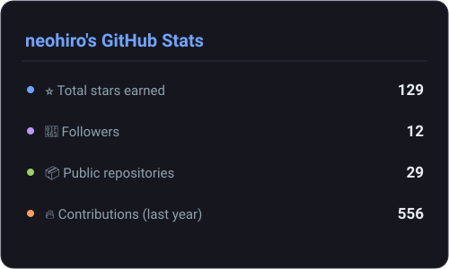
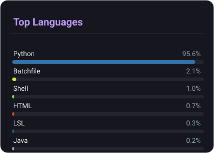

<h1 align="center">👽 METAPOD</h1>

  <b><i>"Defense is the best defense."</i></b> 🛡️

  Open-source <b>security hardening</b> &amp; <b>privacy tools</b> for Windows &amp; Linux

---

### 🛡️ What I build

- 🔒 **Endpoint hardening** — exploit mitigation, system debloating & STIG-style guides
- 🌐 **DNS privacy** — encrypted DNS tooling, sinkholes & domain filtering
- 🕸️ **Network defense** — honeypots, scanners & traffic monitoring
- 🧩 **Practical utilities** — small, focused desktop apps written in Python

### ⚔️ Featured projects

| Project | Description |
| --- | --- |
|  | Windows Exploit Protection settings (Ultimate) GUI |
|  | Cross-platform GUI for dnscrypt-proxy |
|  | Network hardening ┬╖ DNS sinkhole ┬╖ firewall ┬╖ domain filter |
|  | ARP / ICMP passive & active network scanner |
|  | Passive honeypot for home networks |
|  | Cross-platform system health monitor |

### 🧰 Toolbox

### 📊 GitHub stats

  
  

### 🔗 Links

🌐 **[frenzypenguin.media](https://linktr.ee/frenzypenguin.media)**

---

  &nbsp;&nbsp;
  

