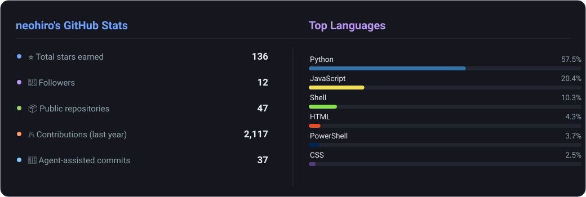

<h1 align="center">👽 METAPOD</h1>

  <b><i>"Defense is the best defense."</i></b> 🛡️ 
  Open-source <b>security hardening</b> & <b>privacy tools</b> for Windows & Linux

### 🛡️ What I build

🔒 Endpoint hardening & debloating · 🌐 LoRa mesh applications · 🕸️ Honeypots & traffic monitoring · 🧩 Practical Python utilities

### ⚔️ Featured projects

| Project | Description |
| --- | --- |
|  | Windows Exploit Protection settings (Ultimate) GUI |
|  | Cross-platform GUI for dnscrypt-proxy |
|  | Network hardening · DNS sinkhole · firewall · domain filter |
|  | Self-healing OpenCode sessions · retries · model rotation · permission autopilot |
|  | Cross-platform .ics/WebCal weather · air quality · astronomy feed |
|  | Passive honeypot for home networks · detects scans, brute-force, IoT malware |
|  | IPv4 + IPv6 DNS lookup · records, reverse lookups, diagnostics |
|  | Role-aware multi-slot LoRa firmware · Meshtastic and MeshCore on one radio |

### 🔐 Hardening guides

| Guide | Description |
| --- | --- |
|  | STIG-style manual + automated Windows 10/11 new-install hardening checklist |
|  | Post-install Linux hardening: firewall, encrypted DNS, Tor routing, fail2ban |

### 🧰 Toolbox

### 📊 GitHub stats

  

### 🔗 Links

<!--
  A pipe table cannot do this. GitHub sizes each column to its own widest cell,
  so the three columns came out 30 / 26 / 29 characters wide and the grid read as
  visibly lopsided. Padding the source cannot fix it either: markdown collapses
  whitespace inside a cell before layout, so any padding added to equalise the
  raw strings is thrown away before the browser ever sees it.

  An HTML table with explicit percentages can, and it is also what makes the
  rules between cells suppressible: `border: 0` plus `border-collapse: collapse`
  means the separators are drawn as nothing rather than as a hairline in the
  theme's border colour, which is what showed through behind the cells.

  Left-aligned deliberately. Centring would fight the long link labels -- they
  sit next to each other with ragged left edges, which reads worse than an
  uneven grid. Keep it left.

  The `width` percentages are what make the columns equal. Change one and the
  other two have to change too, or the grid goes uneven again.
-->
<table style="border-collapse: collapse; border: none; width: 100%; max-width: 720px; text-align: left;">
  <tbody>
    <tr>
      <td style="border: none; padding: 6px 12px 6px 0; width: 33.33%; vertical-align: top;">🌐 <a href="https://neohiro.github.io">neohiro.github.io</a></td>
      <td style="border: none; padding: 6px 12px; width: 33.33%; vertical-align: top;">🔑 <a href="https://neohiro.github.io/mesh-vanity-key">mesh-vanity-key</a></td>
      <td style="border: none; padding: 6px 0 6px 12px; width: 33.33%; vertical-align: top;">🧬 <a href="https://transhumanists.github.io">transhumanists.github.io</a></td>
    </tr>
    <tr>
      <td style="border: none; padding: 6px 12px 6px 0; vertical-align: top;">🎬 <a href="https://frenzypenguin-media.github.io">frenzypenguin-media.github.io</a></td>
      <td style="border: none; padding: 6px 12px; vertical-align: top;">🏝️ <a href="https://openstageisland.github.io">openstageisland.github.io</a></td>
      <td style="border: none; padding: 6px 0 6px 12px; vertical-align: top;">🔗 <a href="https://linktr.ee/frenzypenguin.media">linktr.ee/frenzypenguin.media</a></td>
    </tr>
  </tbody>
</table>

---

  

  🌐 <b><a href="https://linktr.ee/frenzypenguin.media" rel="noopener noreferrer nofollow">frenzypenguin.media</a></b>  
  &nbsp;&nbsp;
  

